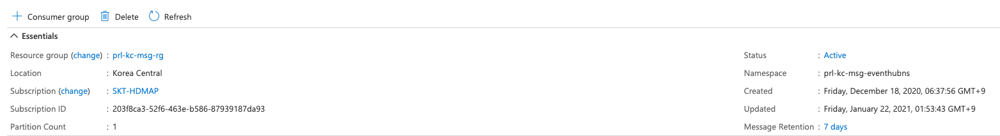

# 소개
crowd sourcing 기반으로 수집된 ROD 데이터를 클러스터링 하고, HD Map Update 알고리즘을 통해 Change Detection 결과를
Azure Eventhub(Pub/Sub) 를 통해 공유하기 위한 인터페이스를 개발한다.

## API Flow


1. change detection 조회
mongodb 저장된 add/delete candidate 정보를 주기적으로(1d) 조회

2. 캠페인 매핑
add/delete candidate 정보와 매칭되는 (/w hdmap_id) 캠페인 데이터 수신

3. Capture Image Download
캠페인 데이터 안에 포함된 차량에서 캡쳐하여 올린 사진 이미지를 blob 에서 다운로드

4. Publish
send module(send_candidate.py) 에서 change detecion 속성 정보(info.json) 와 캡쳐 사진(capture.jpg) 이미지를 protobuf 시리얼라이징을 통해 EH(EventHub) 로 Publish

5. Subscribe
receive module(recv_candidate.py) 에서 데이터 수신후 local /output 경로명에 각 change detecion 속성 정보(info.json) 와 캡쳐 사진 저장 (하단 디렉토리 구조 참고)


## Database

### MongoDB ([Azure CosmosDB](https://azure.microsoft.com/ko-kr/free/services/cosmos-db/?&ef_id=EAIaIQobChMIvLrug9C07gIVy2kqCh1UMwpQEAAYASAAEgKM9vD_BwE:G:s&OCID=AID2100068_SEM_EAIaIQobChMIvLrug9C07gIVy2kqCh1UMwpQEAAYASAAEgKM9vD_BwE:G:s&gclid=EAIaIQobChMIvLrug9C07gIVy2kqCh1UMwpQEAAYASAAEgKM9vD_BwE))

#### DB Strcuture
* candidate
  - add_candidate
  - del_candidate


### PostgreSQL ([Azure PostgreSQL](https://azure.microsoft.com/ko-kr/services/postgresql/?&ef_id=EAIaIQobChMI_I-11tC07gIVlmSLCh0hjQQrEAAYASAAEgItp_D_BwE:G:s&OCID=AID2100068_SEM_EAIaIQobChMI_I-11tC07gIVlmSLCh0hjQQrEAAYASAAEgItp_D_BwE:G:s&gclid=EAIaIQobChMI_I-11tC07gIVlmSLCh0hjQQrEAAYASAAEgItp_D_BwE))

#### DB Structure
* hdmap
  - campaign_scenario
  - campaign_blob_info

add/delete 후보군의 hdmap_id 를 이용하여 현재 진행중인 캠페인 데이터(캡처 이미지)를 맵핑하여 가져오는 쿼리문
```
sql = '''
    select a.obj_key as hdmap_id, b.*
    from campaign_scenario a, campaign_blob_info b
    where a.obj_key = '{hdmap_id}' and a.campaign_id = b.campaign_id;
    '''.format(hdmap_id=hdmap_id)
```

### Blob Strcuture
* Blob (prldrodsa)
file strcuture: prldrodsa/campaign/device_id/campaign_id/capture.jpg

### Eventhub
#### prl-kc-msg-campaign-eventhub 기본정보

- path: prl-kc-msg-eventhubns/prl-kc-msg-campaign-eventhub
- resource group: prl-kc-msg-rg
- namepsace: prl-kc-msg-eventhubns
- message retention: 7days

#### Consumer Group
- consumer_group: nzero


#### SAP (Shared Access Policies)
- nzero (listen)
- rldev (send)


# 사용법

## 테스트 환경
1. python install (3.6.8)
가능하면 virtualenv 환경에서 실행할 것을 추천
[pyenv 이용한 virtualenv 설치방법](http://taewan.kim/post/python_virtual_env/)

2. python 가상환경 activation
```
pyenv activate {your project nane}
```

3. install python package
```
pip install -r requirements.txt
```

4. verify whether installation is ok
```
pip freeze
```

## Publish

### 실행방법
1. Azure Credential 환경변수 정의 (중요 정보이므로 .gitignore 를 통해 repo 관리에서 제외하고, 별도 관리자에게 공유 예정)
```
source skt_secret.sh
```
* 주요 접속정보
  - eventhub
  - blob
  - postgresql
  - mongodb

2. Change Detection 전송
```
python send_candidate.py

2021-01-24 22:36:01,007 - send_candidate.py - INFO - mongodb connected
2021-01-24 22:36:01,476 - send_candidate.py - INFO - ****************************
2021-01-24 22:36:01,476 - send_candidate.py - INFO - start to sending add candidate
2021-01-24 22:36:01,476 - send_candidate.py - INFO - ****************************
2021-01-24 22:36:01,495 - send_candidate.py - INFO - ****************************
2021-01-24 22:36:01,495 - send_candidate.py - INFO - start to sending del candidate
2021-01-24 22:36:01,495 - send_candidate.py - INFO - ****************************
2021-01-24 22:36:02,305 - send_candidate.py - INFO - ver: "0.1"
type: "del"
hdmap_id: "557631910F02N000123"
observe_rate: 0.23999999463558197
category: "signal"
attribute: 502
x: 320825.3125
y: 4158853.5
z: 62.584999084472656
heading: -1.0
```

### Change Detection 전송 조건
#### Add Candidate
- status = 'I' (HDMap Update 알고리즘을 적용하여, Confidence 값이 일정 임계치 이상인 후보군에 대해 I(Insert) 상태로 업데이트 된 후보군들)
- trsfer_chk = 0 (한번도 NZERO 에 전송이 안된 후보군들 대상으로만 전송)

#### Delete Candidate
- 주행횟수(travel_cnt) > 30
- 관측율(observe_rate) = 관측횟수 (observe_cnt) / 주행회수 (travel_cnt) < 30% 이하인 경우. (파라미터 튜닝 필요)


## Subscribe

1. Azure Credential 환경변수 정의 (중요 정보이므로 .gitignore 를 통해 repo 관리에서 제외하였고, NZERO에 안전한 채널을 통해 전달)
```
source nzero_secret.sh
```

2. Change Detecion 수신
* usage
```
python recv_candidate.py <date>
```

* example
```
# 현재 시점부터 구독
python recv_candidate.py

# 현재 시점부터 < 7d 이내 기준, 특정 날짜부터 구독
python recv_candidate.py 2020/12/15
```

3. Change Detecion 구조

* File Structure
```
output
├── add
│   ├── 557631708F01N003562
│   │   └── info.json
│   ├── 557631708F01R999999
│   │   └── info.json
│   ├── 557631735F02N000395
│   │   └── info.json
── del
    ├── 557631735F01N001085
    │   └── info.json
    ├── 557631735F01N001087
    │   └── info.json
    ├── 557631735F01N001097
    │   └── info.json
```

* info.json Structure
```
{
  "ver": "0.1",
  "type": "del",
  "hdmapId": "557631910F01N000387",
  "observeRate": 0.12,
  "category": "sign",
  "attribute": 399,
  "x": 320323.28,
  "y": 4159710.2,
  "z": 65.507,
  "heading": -1.
}
```
